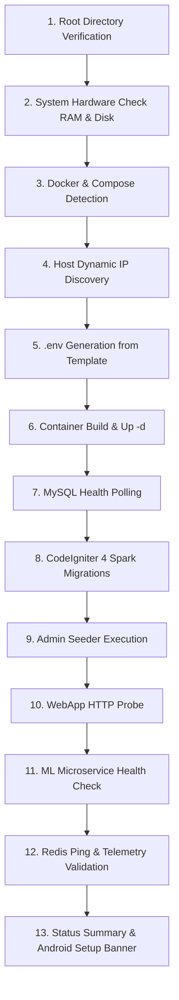
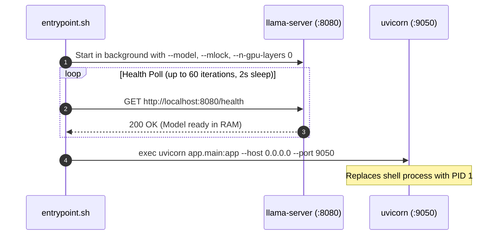

# Container Lifecycle & Deployment Architecture — Smart Finance Platform

This document details the multi-process orchestration, container entrypoint sequence, automated deployment pipeline, and hardware parameters for the **Smart Finance Platform** infrastructure.

---

## 1. Multi-Container Infrastructure Topology

The system deploys via a unified root `docker-compose.yml` comprising four dedicated services:

| Service Name | Container Name | Base Image / Runtime | Exposed Ports | Role & Volume Mounts |
|---|---|---|---|---|
| `web` | `mpesa-web` | PHP 8.3 Apache Debian | `80:80` | WebApp UI, REST gateway, cron daemon. Mounts `web/writable/` for logs and encrypted payloads. |
| `ml` | `ml-mpesa-analyzer` | Python 3.12 slim | `8001:9050` | FastAPI microservice & co-located `llama-server`. Mounts `./ml/models/` for GGUF weights. |
| `redis` | `mpesa-redis` | Redis 7.2 Alpine | `6379:6379` | In-memory session store & query accelerator. Configured with 128 MB `volatile-lru` eviction. |
| `mysql` | `mpesa-db` | MySQL 8.4 LTS | `3306:3306` | Relational database. Mounts persistent named volume `mpesa_db_data:/var/lib/mysql`. |

---

## 2. Automated 13-Step Deployment Pipeline (`scripts/deploy.sh`)

The automated pipeline executes unattended installation, configuration, health verification, and reporting:

---

## 3. Web & Cron Container Lifecycle

### Debian PAM & Cron Daemon Execution
In containerized environments, Debian's default PAM configuration (`pam_loginuid.so`) causes scheduled cron jobs to fail silently. The web container resolves this on startup:
1. Reconfigures PAM via `sed -i '/session required pam_loginuid.so/c\session optional pam_loginuid.so' /etc/pam.d/cron`.
2. Dumps live container environment variables to `/etc/cron_env.sh` on container boot so cron jobs have access to database and Redis credentials.
3. Streams cron execution output directly to `/var/log/mpesa-cron.log`, accessible in real-time via the WebApp admin modal (`GET /admin/crons/daemon-log`).

---

## 4. ML Microservice Startup Sequence (`entrypoint.sh`)

### Hardware & Inference Optimization
- **CPU Pinning (`--mlock`)**: Locks model weight buffers in physical RAM, preventing paging to swap files.
- **CPU Offloading (`--n-gpu-layers 0`)**: Pure CPU inference enabled by default using OpenMP thread allocation (`libgomp1`), guaranteeing compatibility on standard VPS and local CPU servers.
- **Large Context (`--ctx-size 16384`)**: Provides token capacity for multi-turn conversational financial queries and batch transaction classification.
