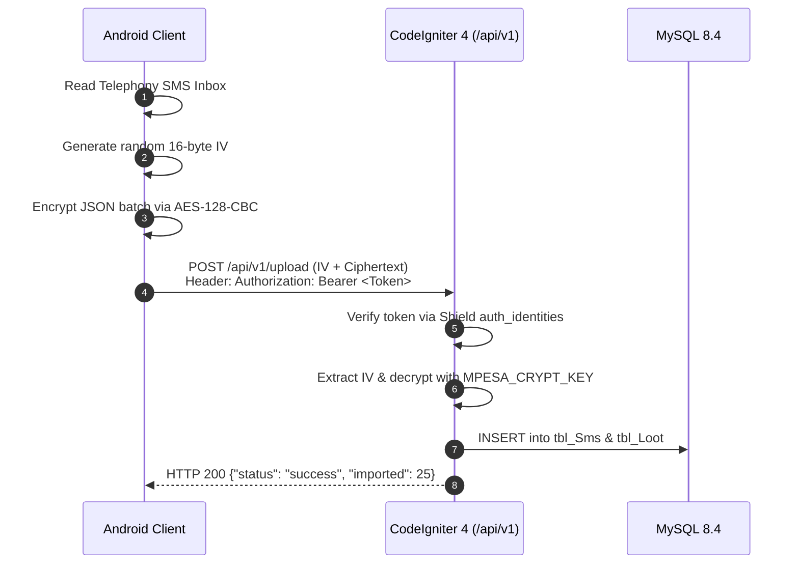

# Android Mobile Client Integration (`Smart-Finance-Android`)

This document outlines the client integration contract between the Android client repository (`Niccher/Smart-Finance-Android`) and the backend platform services in this monorepo.

---

## 1. Client Overview

The Android client is built with:
- **Language & Runtime**: Kotlin 2.0, Android SDK 35 (Android 15), MinSdk 29, Java 17
- **UI Framework**: Jetpack Compose, ViewBinding, Glance App Widget
- **Networking**: Retrofit 2 + OkHttp 4
- **Security**: Android BiometricPrompt (with 30s grace period), AES-128-CBC dynamic IV encryption
- **Local Storage**: Room (via KSP), Jetpack DataStore / Shared Preferences

---

## 2. Ingestion & Ingress Flow

---

## 3. Client API Endpoints Consumed

| Endpoint | Method | Purpose | Authentication |
|---|---|---|---|
| `/api/v1/auth/login` | POST | Authenticate user and issue mobile access token | Basic Auth / Credentials |
| `/api/v1/auth/device` | POST | Register and bind mobile device hardware fingerprint | Bearer Token |
| `/api/v1/upload` | POST | Stream encrypted SMS transaction loot payloads | Bearer Token |
| `/api/v1/financial/overview` | GET | Retrieve classified financial totals and category breakdown | Bearer Token |
| `/api/v1/chat` | POST | Conversational financial queries with user context injection (proxied to ML) | Bearer Token / User ID |
| `/api/v1/chat/history` | GET | Retrieve multi-turn chat history for current user | Bearer Token |
| `/api/v1/chat/history` | DELETE | Clear conversation history | Bearer Token |
| `/api/v1/system/version` | GET | Check minimum app version, updates, and changelog | Public |

---

## 4. Emulator & Network Configuration

When running the Android application against the local monorepo backend in an Android Virtual Device (AVD):

- **Base URL**: Use `http://10.0.2.2/api/v1/` (do not use `localhost`, which maps to the emulator itself).
- **Mobile AI Chat Gateway**: The mobile app communicates with the WebApp port 80 gateway (`http://10.0.2.2/api/v1/chat`), which internally proxies to the FastAPI service (`:9050` in Docker / `:8001` natively). This avoids firewall or NAT issues when exposing port 8001 directly to mobile clients.
- **Cleartext HTTP**: In `debug` builds, ensure `android:usesCleartextTraffic="true"` is enabled in `network_security_config.xml` for `10.0.2.2`.
- **Physical Device**: Connect phone to the same Wi-Fi and set Base URL to the development machine's LAN IP (e.g., `http://192.168.1.100/api/v1/`).

---

## 5. Mobile Intelligence Features

### 5.1 Real-Time SMS Listener & Actionable Alerts
- **BroadcastReceiver**: `SmsReceiver.kt` listens to `Telephony.Sms.Intents.SMS_RECEIVED_ACTION`.
- **Parser**: `MpesaParser.kt` extracts transaction code, direction, amount, counterparty, and balance in under 20ms.
- **Notification**: `TransactionNotificationHelper.kt` presents high-priority heads-up notifications with quick action buttons (`Change Category`, `Add Note`, `Split Bill`) handled by `NotificationActionReceiver.kt`.

### 5.2 Safe-to-Spend Daily Allowance
- Dynamic rolling calculation: $\text{Safe-to-Spend} = \frac{\text{Budget} - \text{Month Spend}}{\text{Days Remaining}}$.
- Configurable monthly budget targets stored via `AppPrefs.kt`.
- Color-coded progress ring and feedback on `HomeFragment.kt`.

### 5.3 Fuliza & Digital Loan Tracker
- Real-time loan ledger via `LoanTrackerHelper.kt`.
- Aggregates total borrowed, total repaid, outstanding balances, and cumulative access fees across Fuliza and M-Shwari.

### 5.4 Homescreen Glance Widget
- `MpesaGlanceWidget.kt` (`AppWidgetProvider`) displays account balance, daily spend, and Safe-to-Spend allowance directly on the Android home screen.
- Quick sync button triggers background upload without opening the application.

### 5.5 "Ask My M-Pesa" AI Assistant
- `ChatActivity.kt` provides an in-app conversational assistant supporting Kenyan English and Sheng.
- Connects through the WebApp gateway proxy `/api/v1/chat` with dynamic LLM model detection and contextual spending injection.
